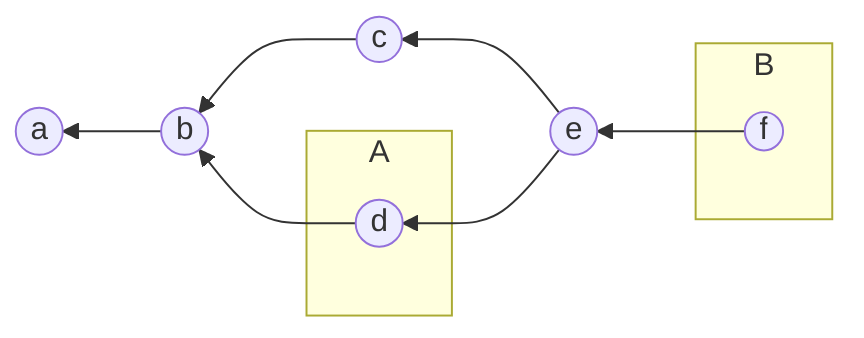
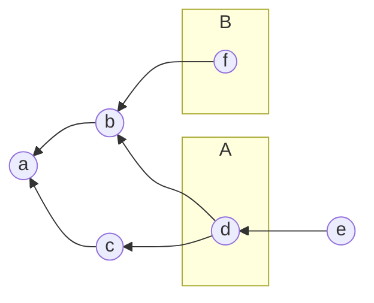
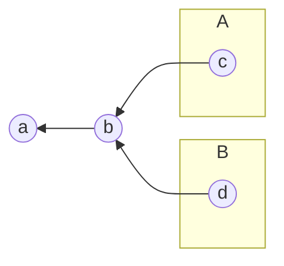
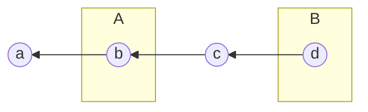

<!--
SPDX-FileCopyrightText: 2020 German Aerospace Center (DLR)

SPDX-License-Identifier: CC-BY-4.0
-->

# Episode 4 - Rebasing

- Objective: Learn the basic rebase procedure
- Estimated time: 45min
- Teaching techniques: Live Coding

## Rebasing

Rebasing is another option to integrate work on a feature branch into the `master` branch.

### Create a Feature Branch (step 1)

- Create new branch `add-changelog` and switch to it
  - `git checkout -b add-changelog` (Git version >= 2.23 supports: `git switch -c <BRANCH NAME>`)
  - Highlight that we combined the commands branch and checkout/switch by using `-b`/`-c`
- Add some content
  - Add [CHANGELOG.md](../code/04_rebase_step-1/CHANGELOG.md) from workshop materials
  - `git add CHANGELOG.md`
  - `git commit -m "Add initial changelog"`
  - Explain what changed and verify it with `git graph`

```
      o <- HEAD, add-changelog
     /
o - o <- master
```

### Add an extra Commit to the Feature Branch

- Add another change to `add-changelog`
  - Add the line `> WARNING: Initial prototype which is not ready for productive use!` in section `0.1.0`
  - `git add CHANGELOG.md`
  - `git commit -m "Add warning for release 0.1.0"`
  - Verify with `git graph`


```
      o - o <- HEAD, add-changelog
     /
o - o <- master
```

### Perform some Work on the `master` Branch (step 2)

- Switch to branch `master` and add some content
  - `git checkout master` (Git version >= 2.23 supports: `git switch <BRANCH NAME>`)
  - Add [README.md](../code/04_rebase_step-2/README.md) from workshop materials
  - `git add README.md`
  - `git commit -m "Add usage hint for interactive mode"`
  - Verify with `git graph`
  - Highlight that merging the branch `add-changelog` into the `master` would result in a `3-Way-Merge`


```
      o <- add-changelog
     /
o - o - o <- HEAD, master
```

### Rebase the Feature Branch

- Switch to branch `add-changelog` via: `git checkout add-changelog` (Git version >= 2.23 supports: `git switch <BRANCH NAME>`)
- Rebase onto the new commit on branch `master`
  - `git rebase master`
  - Verify with `git graph`
  - Highlight that the feature is now based on the latest commit of the `master` branch
  - Highlight that a `Fast-Forward-Merge` is now possible

```
          o <- HEAD, add-changelog
         /
o - o - o <- master
```

### Merge the rebased Feature Branch


- Switch to branch `master` via: `git checkout master` (Git version >= 2.23 supports: `git switch <BRANCH NAME>`)
- Merge the `add-changelog` branch into the `master` branch
  - `git merge add-changelog`
  - Highlight that merging was performed using a Fast-Forward-Merge
  - Verify with `git graph`


```
o - o - o - o <- HEAD, master, add-changelog
```

### Clean up

- Delete the branch `add-changelog`, since it is merged, via: `git branch -d add-changelog`

## Pros and Cons of Rebasing

| Pros | Cons |
| ------ | ------ |
| Streamlines history | Can hide context (history) |
| Manipulating single commits is easy (revert) | Rebase on public branches can be dangerous |
| Avoids merge commit | Potentially more work than merging |
| | Sometimes a force push is required|


## Quiz

Is a Fast-Forward Merge from label `A` into `B` possible?

a)


b)


c)


d)


<details>
<summary>Solution:</summary>

1. Yes
2. No 
3. No
4. Yes

</details>

## Key Points

- Rebasing is another option to integrate work on a feature branch into the `master` branch.
