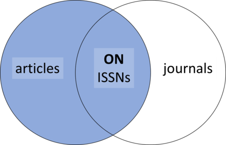
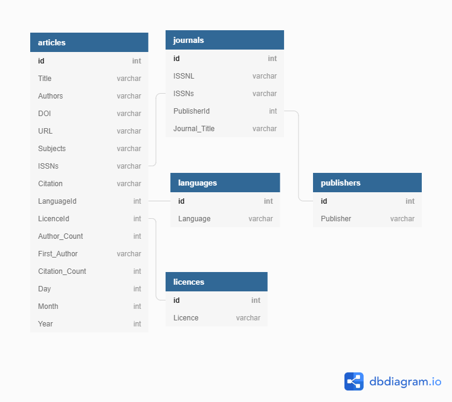

## Joins

Die SQL-Klausel `JOIN` erlaubt es uns, Spalten aus einer oder mehreren Tabellen in einer Datenbank zu kombinieren, indem wir Werte verwenden, die allen gemeinsam sind. Sie folgt "FROM" in einer SQL-Anweisung. Wir müssen dem Computer auch mitteilen, welche Spalten die Verbindung zwischen den beiden
Tabellen mit dem Wort `ON`.  

Beginnen wir damit, die Daten aus der "articles"-Tabelle mit der "journals"-Tabelle zu verbinden. Die `ISSNs`-Spalten in diesen beiden Tabellen verbinden sie.

~~~
SELECT *
FROM articles
JOIN journals
ON articles.ISSNs = journals.ISSNs;
~~~

`ON` ist ähnlich wie `WHERE`, es filtert Dinge nach einer Testbedingung heraus.  Wir benutzen das Format `table.colname`, um dem SQL-Interpreter mitzuteilen, auf welche Spalte in welcher Tabelle wir uns beziehen.

Wir können diesen JOIN anhand des folgenden Diagramms darstellen.

Alternativ können wir das Wort `USING` als Kurzform verwenden.  In diesem Fall sagen wir, dass wir `articles` mit `journals` kombinieren wollen und dass die gemeinsame Spalte `ISSNs` ist.

~~~
SELECT *
FROM articles
JOIN journals
USING (ISSNs);
~~~

Diese Abbildung zeigt die Beziehungen zwischen den Tabellen und hilft bei der Visualisierung des Zusammenfügens oder Verknüpfens der Tabellen in der Datenbank:  
  
Über [relationales Datenbankdesign](https://librarycarpentry.org/lc-sql/08-database-design/index.html) werden wir in der nächsten Episode berichten. Zusätzlich zu den obigen visuellen Erläuterungen bietet *[SQL Join Types Explained Visually](https://dataschool.com/how-to-teach-people-sql/sql-join-types-explained-visually/)* visuelle/animierte Beispiele, die den Lernenden helfen sollen, zu verstehen, was in SQL `JOIN`s geschieht.

Wenn wir Tabellen verbinden, können wir die gewünschten Spalten mit `table.colname` angeben, anstatt alle Spalten mit `*` auszuwählen. Zum Beispiel:

~~~
SELECT articles.ISSNs, journals.Journal_Title, articles.Title, articles.First_Author
FROM articles
JOIN journals
ON articles.ISSNs = journals.ISSNs;
~~~

Verknüpfungen können mit Sortieren, Filtern und Aggregation kombiniert werden.  Wenn wir also die durchschnittliche Anzahl der Autoren für Artikel in jeder Zeitschrift ermitteln wollten, können wir die folgende Abfrage verwenden:

~~~
SELECT articles.ISSNs, journals.Journal_Title, AVG(articles.Author_Count)
FROM articles
JOIN journals
ON articles.ISSNs = journals.ISSNs
GROUP BY articles.ISSNs;
~~~

> ## Herausforderung
> Schreibe eine Abfrage, die die Tabellen `articles` und `journals` verbindet und die den `Journal_Title`, die Gesamtzahl der 'Title' und den durchschnittlichen 'Citation Count' für jede ISSN zurückgibt.
>
> > ## Lösung
> > ~~~
> > SELECT journals.Journal_Title, COUNT(Title), AVG(articles.Citation_Count)
> > FROM articles
> > JOIN journals
> > ON articles.ISSNs = journals.ISSNs
> > GROUP BY articles.ISSNs;
> > ~~~
>

Ihr könnt auch mehrere Tabellen verbinden. Zum Beispiel:

~~~
SELECT articles.Title, articles.First_Author, journals.Journal_Title, publishers.Publisher
FROM articles
JOIN journals
ON articles.ISSNs = journals.ISSNs
JOIN publishers
ON publishers.id = journals.PublisherId;
~~~

> ## Herausforderung:
>
> Schreibe eine Abfrage, die den `Journal_Title`, den `Publisher` und die Anzahl der
> 'Title', geordnet nach der Anzahl der 'Title' in absteigender Reihenfolge zurückgibt.
>
> > ## Lösung
> > ~~~
> > SELECT journals.Journal_Title, publishers.Publisher, COUNT(Title)
> > FROM articles
> > JOIN journals
> > ON articles.ISSNs = journals.ISSNs
> > JOIN publishers
> > ON publishers.id = journals.PublisherId
> > GROUP BY Journal_Title
> > ORDER BY COUNT(Title) DESC;
> > ~~~
>

Es gibt verschiedene Arten von Joins, über die ihr unter [SQL Joins Explained](http://www.sql-join.com/sql-join-types) mehr erfahren könnt.

## Aliasnamen

Da die Anfragen immer komplexer werden, können die Namen lang und unhandlich werden. Um die Dinge klarer zu machen, können wir Aliase verwenden, um den Elementen in der Abfrage neue Namen zuzuweisen.

Wir können beiden Tabellen Aliase geben:

~~~
SELECT ar.Title, ar.First_Author, jo.Journal_Title
FROM articles AS ar
JOIN journals AS jo
ON ar.ISSNs = jo.ISSNs;
~~~

Und Spaltennamen:

~~~
SELECT ar.title AS title, ar.first_author AS author, jo.journal_title AS journal
FROM articles AS ar
JOIN journals  AS jo
ON ar.issns = jo.issns;
~~~

Das `AS` ist technisch nicht erforderlich, es ginge auch so:

~~~
SELECT a.Title t
FROM articles a;
~~~

Aber die Verwendung von `AS` ist viel klarer, es gehört also zum guten Stil es einzubeziehen.
